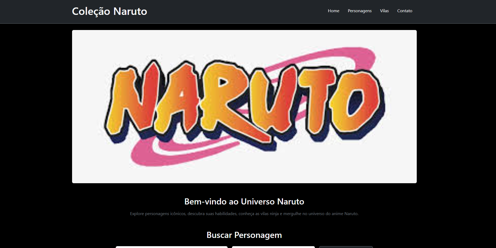

# Trabalho Prático 05 (Semana 06)

Nessa atividade, como sempre, vamos evoluir o que foi feito na semana anterior. Fique atento para fazer o projeto da semana anterior e dar sequência nessa jornada.

No trabalho dessa semana vamos alterar o projeto para que a responsividade da home-page seja feita, agora, com o framework Bootstrap.

**IMPORTANTE 1:** Estaremos utilizando uma ferramenta de verificação automática para te ajudar a identificar se você conseguiu fazer o que é necessário. Essa ferramenta é o autograder e todas as vezes que você submeter o repositório ao GitHub via **`git push`**, será gerado um arquivo **`relatorio.md`** na raiz do seu repositório com detalhes da correção. Para continuar trabalhando no seu computado, será importante realizar o comando **`git pull origin main`** para atualizar sua versão local com o relatório gerado no GitHub. **FIQUE ATENTO**

**IMPORTANTE 2:** Você deve alterar apenas os arquivos **`README.md`**, **`index.html`** e **`css/styles.css`**, podendo incluir outros arquivos como imagens na pasta **`images`**, caso necessário. Deixe todos os demais arquivos e pastas desse repositório inalterados. **PRESTE MUITA ATENÇÃO NISSO.**

## Informações Gerais

- Nome: Pedro Augusto Noronha Palumbo 
- Matricula:  915705
- Proposta de projeto escolhida: 4. coleções e  itens
- Breve descrição sobre seu projeto: O projeto consiste em uma aplicação web que apresenta uma coleção de personagens do anime Naruto, exibindo informações visuais e organizadas sobre cada personagem, como nome, imagem e futuramente outras características.

## Print da versão responsiva com Bootstrap [DESKTOP]

## Print da versão responsiva com Bootstrap [MOBILE] (*)

(*) Utilize as ferramentas do desenvolvedor do seu navegador para colocar no modo reponsivo, escolha um celular qualquer e recarregue a página antes de tirar o print. 